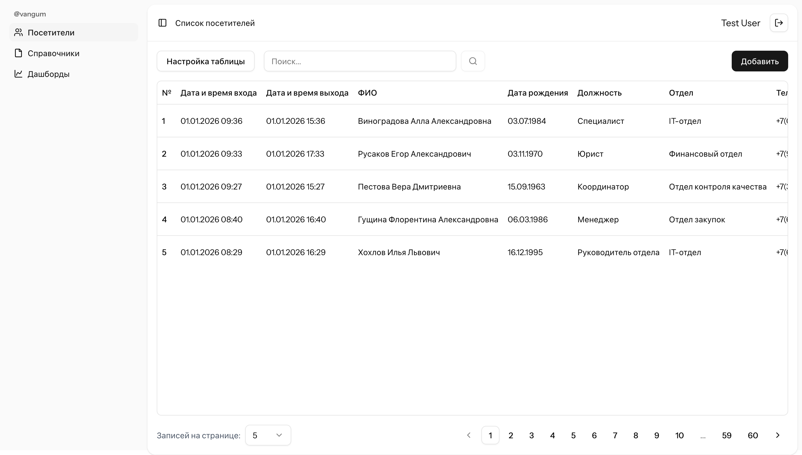

# Security service

A web application for managing visitors and departments. Built with **Laravel 12**, **Inertia.js**, and **Vue 3**. The system allows admins and users to manage visitor records, track documents, and handle departments efficiently.

---

## Features

- **CRUD for Visitors**: Create, read, update, and delete visitor records
- **CRUD for Departments**: Manage departments easily
- **Authentication**: Login with username and password
- **Dynamic Documents**: Handles passport, driver license, and other document types
- **Search & Filtering**: Search by visitor name, phone, position, or department
- **Pagination**: Adjustable per-page records (5, 10, 20, 50, 100)
- **Soft Deletes**: Track who deleted or updated records
- **SPA Interface**: Built with Inertia.js and Vue 3 for fast navigation

---